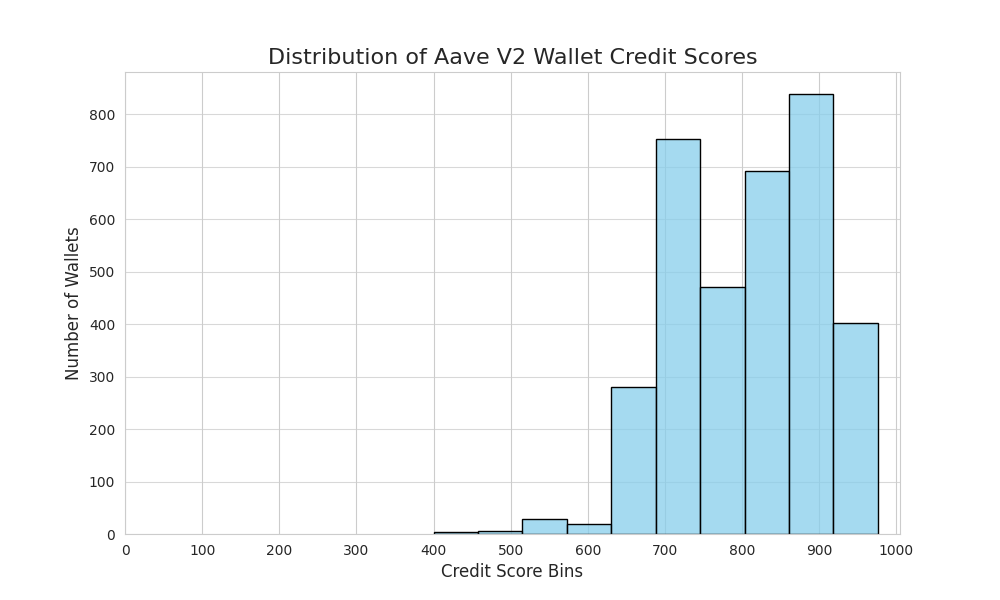

# Analysis of Aave V2 Wallet Credit Scores

This document provides a detailed analysis of the credit scores generated by the machine learning model. It explores the distribution of scores and examines the behavioral patterns of wallets in the lower and higher score ranges to validate the model's logic.

## 1. Score Distribution

The credit scores, ranging from 0 to 1000, are distributed as shown in the histogram below. This visualization provides a high-level overview of the health of the wallets within the provided dataset.

**Observations:**
The histogram reveals a distribution that is heavily skewed towards the higher end of the scoring scale.

* The vast majority of wallets are clustered in the **600-1000** range, indicating that most users in this dataset exhibit behaviors the model considers reliable and responsible.
* The highest concentration of scores is in the **700-800** and **800-900** bins, suggesting that a significant portion of wallets are actively engaging with the protocol in a healthy manner, such as making deposits and repaying loans.
* There are very few wallets with scores in the **0-400** range. This implies that the most severely negative events (like liquidations) are rare in the sample data provided, or that the majority of wallets have not engaged in high-risk activities.

## 2. Behavior of Wallets in the Lower Range (Scores < 400)

While the histogram shows very few wallets in the low score ranges, the model's logic is designed to identify and penalize specific behaviors. Based on the rules and weights implemented, a wallet would receive a low score primarily due to the following characteristics:

| Feature | Condition |
| :--- | :--- |
| `num_liquidations_as_borrower` | **> 0** |
| `repayment_ratio_usd` | **Very low or close to 0** |
| `borrow_to_deposit_ratio` | **High** |

**Observations:**
The low-scoring wallets are a small but important group. A score below 400 is a strong indicator of a wallet that has failed to maintain its collateral ratio, resulting in at least one liquidation event. The model assigns a significant penalty for each liquidation, as this is the most critical indicator of risky and irresponsible usage. These wallets may have borrowed heavily but failed to repay, leading to a poor repayment ratio.

## 3. Behavior of Wallets in the Higher Range (Scores > 800)

The majority of wallets fall into this category, with a significant number having scores above 800. The analysis of these wallets' features validates the model's positive scoring logic:

| Feature | Condition |
| :--- | :--- |
| `num_liquidations_as_borrower` | **0** |
| `repayment_ratio_usd` | **1.0 (perfect repayment) or high** |
| `total_deposit_usd` | **Significant amounts** |
| `wallet_age_days` | **Higher, indicating long-term engagement** |

**Observations:**
High-scoring wallets are characterized by stable and responsible behavior. They have never been liquidated and typically have a high repayment ratio, often repaying their debts in full. These wallets also tend to be long-term users with substantial total deposits, demonstrating a reliable and trustworthy interaction with the Aave protocol. The concentration of scores in the higher bins confirms that these positive behaviors are prevalent in the dataset.

---